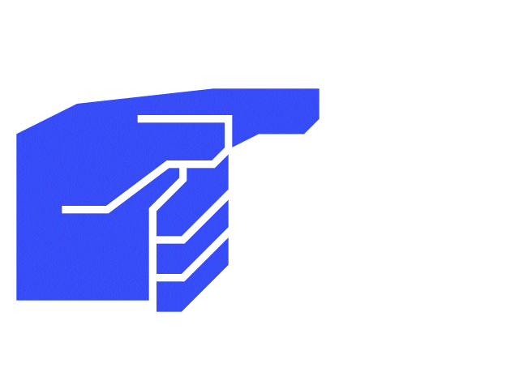

<h1 align="center">
  
</h1>

  

<h2>📝 Table of Contents</h2>
<ul style="list-style-type: none;">
  <li> <a href="#tech-stack">My Tech Stack & Skills</a></li>
  <li> <a href="#experience">Experience</a></li>
  <li> <a href="#connect">Connect with Me</a></li>
</ul>

<h2 id="tech-stack">🛠️ My Tech Stack & Skills</h2>

<h3>💻 Core Languages</h3>

  &nbsp;
  

### 📚 Libraries & Frameworks

  &nbsp;
  

### 🌐 Web Technologies & Markup

  &nbsp;
  

---

<h2 id="experience">💡 Experience</h2>

---

### **Frontend Developer (Volunteer)** for IT-Today IPB University
*_(April 2025 – Present)_*

* Contributed to UI/UX design (login, dashboard), prioritizing user experience.
* Designed wireframes/mockups in Figma.
* Developed interactive frontend features with React and Tailwind.
* Managed frontend logic (authentication, dynamic data).
* Integrated with backend APIs for real-time data.

---

<h2 id="connect">📫 Connect with Me</h2>

  <a href="https://www.linkedin.com/in/jcalvink/">
    
  </a>

---
